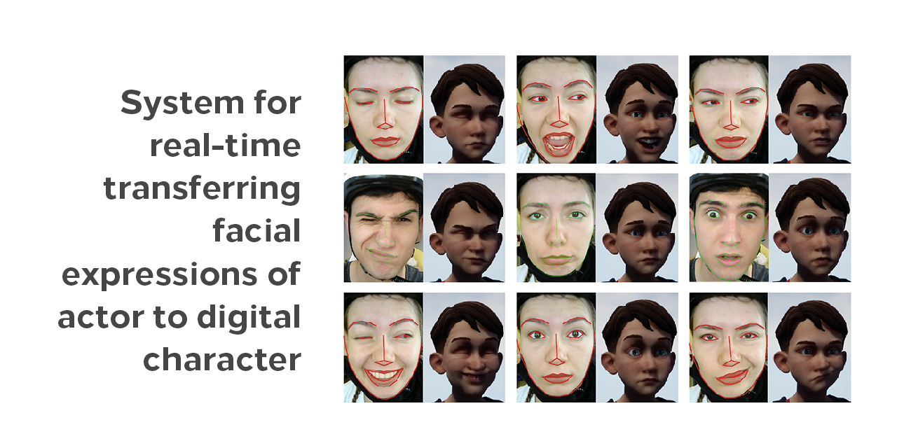
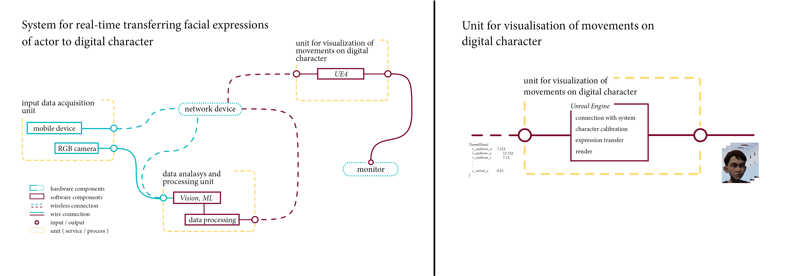

# Unit-for-Visualization-of-Expressions-UE4

## Video

The link of the video shows a short demo of results.

https://www.youtube.com/watch?v=s5cxJsi77JA

## Description

The project was done as part of my B.Sc. thesis. 

Unit for visualization of facial expressions is a computer station with appropriate software support, which is part of the system (shown in the figure below) for real-time transferring facial expressions of the actor to digital character. 

The unit obtained input data from the data analysis and processing unit (https://github.com/acoMCMXCVI/Data-Analysis-and-Processing-Unit), that is to say, sequence of facial movements in time, transfers to digital character in real time, and then for output data gives sequence of images (renders).

## _Assets_

The character that was used is a part of “A boy and his kite” demo which can be found in Unreal store:
https://www.unrealengine.com/marketplace/en-US/store

## Usage

In order of successfully implementation of the system, it is necessary to install all parts of the system. 
For all details, feel free to contact me by e-mail:  rajicaleksandar6@gmail.com.
